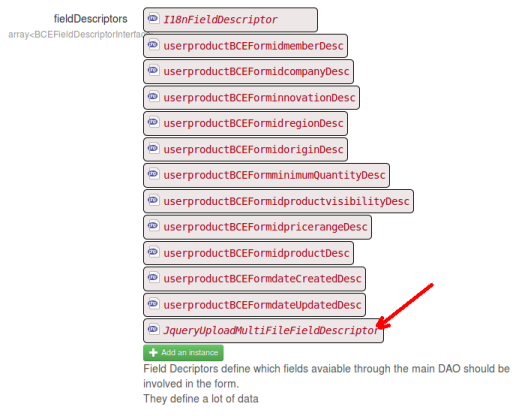

About the jQuery file upload descriptor and renderer for BCE
============================================================

BCE is a form builder for the [Mouf framework](http://mouf-php.com).
This package contains classes enabling the use of the **jQuery file upload** plugin right into forms generated by BCE.

How to use it
-------------

###Single file uploads:
TODO

###Multi file uploads:

If you want to upload multiple files associated to a bean, it is likely you have a database table containing the list of files.

For instance, if you have a form representing a product, and if the product can have many photos attached to it, you certainly have a "products" table and a "product_photos" table that points towards product. Therefore, you probable have a `ProductPhotoDao` and `ProductPhotoBean` class.

The first thing to do is this:

- `ProductPhotoDao` (the DAO of the table that contains the list of files) should implement the `FileDaoInterface`
- `ProductPhotoBean` (the Bean of the table that contains the list of files) should implement the `FileBeanInterface`

####FileDaoInterface
```php
interface FileDaoInterface extends DAOInterface {
	/**
	 * Returns a list of beans implementing the FileBeanInterface associated with the main bean containing the files.
	 * 
	 * @param TDBMObject $mainBean
	 */
	function findFiles($mainBean);
}
```

The `findFiles` method will return the list of beans of the "file" table. If you are using TDBM, a typical implementation is:

```php
public function findFiles($mainBean) {
	// Returns a list of FileBeanInterface associated to $mainBean
	return $this->getListByFilter($mainBean);
}
```

####FileBeanInterface
```php
interface FileBeanInterface {
	/**
	 * Returns the full path to the file.
	 */
	function getFullPath();
	
	/**
	 * Sets the name of the file to be stored.
	 * 
	 * @param string $fileName
	 */
	function setFileName($fileName);
	
	/**
	 * Sets the main bean we are pointing to.
	 * 
	 * @param TDBMObject $mainBean
	 */
	function setMainBean($mainBean);
}
```

Please note that `getFullPath` should return the complete path to the file stored on disk on the server.
`setFileName` is only setting the name of the file (not the path). Finally `setMainBean` is setting the
object the file is related to. In our exemple, that would be an instance of `ProductBean`.

Are you done? Well, now, implementing the jQueryFileUpload mechanism should be a breeze!

Go to your `BCEForm` in instance mode, and in the list of `fieldDescriptors`, drag'n'drop a 
`JqueryUploadMultiFileFieldDescriptor`.



Now, configure the instance you just drag'n'dropped:

TODO
